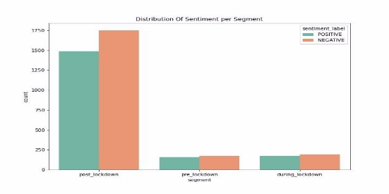

**THE IMPACT OF COVID-19 ON AIR QUALITY**

- Haddy Adnan.
- Brian Odhiambo.
- Ada Kibet.
- Amure Ridwan.
- Samuel Negash.

**Hypothesis**

Ho: There is no difference

H1: There are more air quality, air pollution mentions post lockdown than pre lockdown

**Theoretical Overview**

Covid-19,  the  pandemic,  has  resulted  in extreme measures being put in place by different countries  all  in  an  attempt  to  slow  its  spread.  Some  of  the  common  interventions  being movements  restriction,  lockdown  and  curfew  implementation  which  form  the  basis  of  our research and analysis.

We use data from Twitter to analyse the trends and patterns on topics related to air quality focusing on 3 countries: South Africa, Kenya and Nigeria. Main time frames to be focused on are the *pre*, *during* and *post* lockdown frames as follows:

1. Pre-lockdown - 2019-12-01 to 2020-03-31
2. During lockdown - 2020-04-01 to 2020-06-30
3. Post-lockdown - 2020-07-01 to 2020-10-06

**Data**

- Focusing  on  the  3 countries, we first scraped the screen\_names of accounts tweeting about air quality using geotags and hashtags filters. Hashtags used are as follows:

*"Airquality",  #cleanair,  #airpollution,  #pollution,  #hvac,  #airpurifier, #indoorairquality  ,  #freshair,  #airfilter,  #airqualityindex,  #pm2\_5  , #emissions,  #natureishealing,  #pollutionfree"  ,"#wearethevirus", #blueskychallenge,  #globalwarming,  '#airpollutionawareness, #airpollutioncontrol,  #CleanEnergy,  #soot,  #carbon,  #sulfur,  #coal, #pollutant, #'hygroscopicity, #Hydrochlorofluorocarbon, #Hydrochlorofluorocarbon, #blueskychallenge.*

- We  scraped  500  tweets  within the time frame of interest (December 2019 to October  2020)  from  each  user's  timeline.  Alongside  the tweets, the following features  were  also  scraped:  *tweet\_timestamp,  account\_createddate, retweet\_count,  likes\_count,  screen\_name, tweet\_id,  account\_description, location, number of friends, no of followers, account verification status, entities, hashtags* and *language.*

**EXPLORATORY DATA ANALYSIS**

The 3 time series plots below represent tweets volume across time on:  *the entire dataset, dataset excluding the retweets* and *a random sample of the dataset.*

A random sample is a subset of items chosen from a larger set. Each item is chosen randomly and entirely by chance, such that each has the same probability. Random sampling is done to check for the trend persistence.

A plot is done also excluding the retweets to ensure that the trend produced is not as a result of retweets.

All the 3 plots display similar trends, thus safe to conclude that the signals picked from the trends are not false.

For a closer look into the signals, we make trend plots for the 3 frames: *pre lockdown, during lockdown* and *post lockdown.*

1. **Pre-lockdown period**

There are relatively high levels of tweeting in December 2019 and around February 2020.  What are some of the topics trending on these peak periods?

We see evidence of people’s interest in climate change, pollution, and nature among other topics. The covid-19 hashtag is also visible, an indication that people have started talking about it. The decrease of tweets from February to March might signify a shift of tweets from topics around air quality to Covid 19 as we can see from the image below.

**Pre lockdown topic Modeling:**

The circles visible on the left panel in the plot below represent different topics and the distance between them.

The  topics  are  generated  from  Latent  Dirichlet  allocation  modeling,  a  generative probabilistic  model  that  assumes  each  topic  is  a  mixture  over an underlying set of words, and each document is a mixture of over a set of topic probabilities.

The similar topics appear closer and the dissimilar topics farther. The relative size of a topic's circle in the plot corresponds to the relative frequency of the topic in the entire tweets set.

The circles are farther apart indicating low levels of similarity of the main topics during the pre lockdown phase.

The bar chart on the left panel of the plot shows the top-30 most  noticeable terms in the set of tweets. A term's saliency is a measure of both how frequent the term is in the corpus and how distinctive it is in distinguishing between different topics.  For instance, for  topic  3,  some  salient  terms  are:  *climatechange*,  *nature*,  *food*, *carbon*, *emission*, *carbon* et.c.

2. **During lockdown period**

A peak noticed around May. This is shortly after lockdown has been implemented by most countries. This could have been triggered by air quality week  awareness event that happened on the 3rd week of April.

A peak is observed around June too. This may be due to people observing changes in air quality as a result of the lockdown, hence, they are talking about it.

Taking a look at the word cloud:

Comparing  this  to  the  pre-lockdown  word  cloud,  the  words:  *covid19,  airpollution,  carbon, coronavirus, emission, co2,* and *airquality* are more salient. A clear indication of topic deviation and people gaining more interest in air quality. *Climatechange* ‘s popularity remains constant.

**During lockdown topic Modeling:**

60% of the circles are super close to each other indicating high levels of topic similarity, a new development in comparison to the pre-lockdown phase.

This observation alongside the change in the salient words is an indication that there’s more talk on air quality.

3. **During lockdown period**

Steady rise from late August to October. Most of the lockdown restrictions are relaxed and it is business as usual. The rise may have been triggered by [Clean Air for Blue Sky](https://twitter.com/UrbanBetter) organized  by  UrbanBetter,  which  did  trend  with  #blueskychallenge hashtag. [International Day of Clean Air for Blue Skies 2020](https://www.afro.who.int/regional-director/speeches-messages/international-day-clean-air-blue-skies-2020) organized by WHO also played a role in sensationalizing people about air quality especially in Africa.

*Covid19*  is  less salient post lockdown. *climate, airpollution, polluiton, globalwarming, coal,  highlevel,*   and *globalwarming* among other air quality related topics are more visible. A clear indication of topic deviation and  a growing interest in airquality.

**Post-lockdown topic Modeling:**

Like  in  the  lockdown  duration,  60%  of  the  circles  are  super  close  to  each  other indicating high levels of topic similarity.

This observation alongside the change in the salient words is an indication that there's more talk on air quality.

**CONCLUSION FROM THE THREE FRAMES:**

- There’s topic deviation across time. People are getting into topics related to air quality.
- There’s convergence in tweets topics. People begin tweeting more about similar stuff, and based on our data, air quality and its environs, to be precise.
- There's an increase in tweets volume across time. More people start tweeting, or the normal tweeps are tweeting more frequently.

Now inspecting the trends in tweeps (twitter peeps):

**CONSISTENCY OF USERS ACROSS TIME TALKING ABOUT AIR QUALITY** Our goal here is to look at tweeps tweeting at different times (pre lockdown, during and post  lock  down).  Are  the  users  different?  or  are  there  the  same?  Is  their  volume increasing or decreasing?  Are they verified or not? Are the accounts for organisations, an individual or bots?

The tweeps trend is the same as the tweets trend: the number of tweeps is overally increasing.

Most of the accounts are personal.

Around 90% of the accounts are not verified.

Interesting how most of the users are not verified and yet the tweets trend and volume has a very slight difference. This could mean that the verified users tweet way more frequently than the non verified users.

**Pre-lockdown, during-lockdown** and **post-lockdown tweeps screen names word cloud.**

Taking a look at the screen names in the 3 frames to check for consistency and volume changes.

The top tweeps in the 3 frames are different, an indication that new people are picking up on the air quality talk.

There’s still some aspect of consistency though with tweeps like *UNDP\_GCRED.*

In reference to the tweeps distribution across the 3 frames, they increase with time, an indication that more people are picking up on air quality talk probably as a result of the lockdown implemented. This adds more support to the conclusion that the increase in tweets volume is as a result of more people tweeting.

Now looking into country tailored plots…

**COUNTRIES COMPARISON**

We have more tweets from Kenya and Nigeria than South Africa. The trend is uniform though.

Kenya has the most number of tweeps and tweets, followed by Nigeria then South Africa.

The *nan* represents tweeps who don’t include locations details in their accounts so they could belong to either of the three countries.

**Most used words in tweets per country**

The  word  *climatechange*  is  predominant  in  all  the  countries  across the time period under study. However, *blueskychallenge* stands out in South Africa. Blueskychallenge did trend after lockdown, in the month of September when a world clean air day event occured.  This  could  be  an  indication  that  more  South  Africans  participated  in  the *blueskychallenge*.

**SENTIMENT ANALYSIS**

Sentiment Analysis is the process of determining whether a piece of writing is positive, negative or neutral.

In our context, we classify tweets as positive or negative.

People showed an almost equal level of sentiment towards air quality across the time period under  study.  However,  post  lockdown  shows  more  negative  sentiment  compared  to  other periods.  This  could  signal  people  complaining  about  bad  air  quality  before  lockdown  was implemented. Most complaints come from individuals and not organizations. There is also a good amount of positive sentiments during post lockdown showing appreciation of good air quality.

**TESTS OF SIGNIFICANCE**

- Using **Z test**: a statistical test to determine whether two population means are different.
- Were there more air quality mentions after lockdown than before lockdown? Hypothesis:

***H0:*** There is no difference in the volume of tweets pre and post lockdown. ***H1:*** There is a difference in the volume of tweets pre and post lockdown.

**Conclusion**:  At  alpha  =  0.05,  and  p-value  =  0.9,  There  is  no  enough evidence to reject H0 and hereby conclude that based on the data we have there  is  no  difference  between  the  volume  of  tweets  before  and  after lockdown.

- Using  **kruskal  wallis  non  parametric**  test  (non  parametric test because the homoscedasticity assumption was not satisfied):
- Is there any significant difference between the sentiments in the three periods?

***H0:*** : There is no difference in the sentiments.

***H1:*** There is a difference in sentiments in at least 2 of the periods.

At alpha = 0.05  and p-value = 0.68, There is not enough evidence to reject H0  and  therefore  conclude  that  based  on  the  data  we  have,  there  is  a difference in sentiments in at least 2 of the periods

**CONCLUSION**

- There’s an increase in the number of air-quality related tweets over time.
- There’s an increase in the number of tweeps over time.
- There’s topic deviation across time. People are getting into topics related to air quality.
- There’s convergence in tweets topics. People begin tweeting more about similar stuff, and based on our data, air quality and its environs, to be precise.
- There are more tweeps in Kenya than South Africa and Nigeria.
- The difference in tweets volume in the pre-lockdown and post-lockdown phases is not statistically significant.
- Most of the tweets' sentiments are negative.

**LIMITATIONS AND CHALLENGES**

1. Huge amount of data needs to be scraped given that a lot of filtering is to be done to remain only with the necessary tweets.
1. Classification of tweeps into promotional and non promotional groups.
1. Low amount of relevant data.
1. Some userful Twitter API features are only limited to premium account types.

**REFERENCES**

- [https://africanarguments.org/2020/10/08/coronavirus-in-africa-tracker-how-many- cases-and-where-latest/](https://africanarguments.org/2020/10/08/coronavirus-in-africa-tracker-how-many-cases-and-where-latest/)
- <https://agupubs.onlinelibrary.wiley.com/doi/full/10.1029/2018JD029336>
- <https://earth.org/air-pollution-is-starting-to-choke-africa/>
- <http://docs.tweepy.org/en/latest/>
